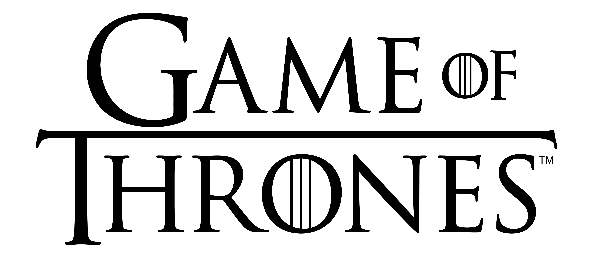
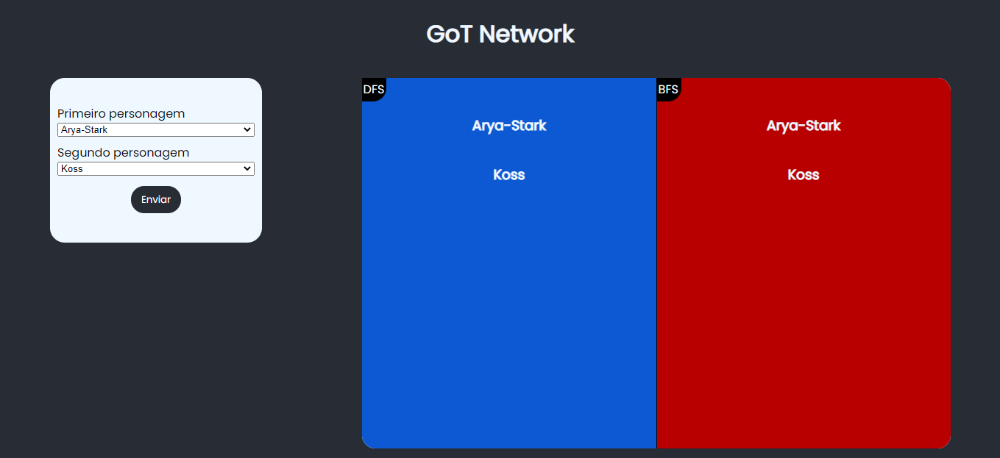
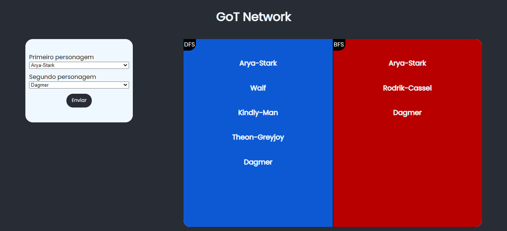
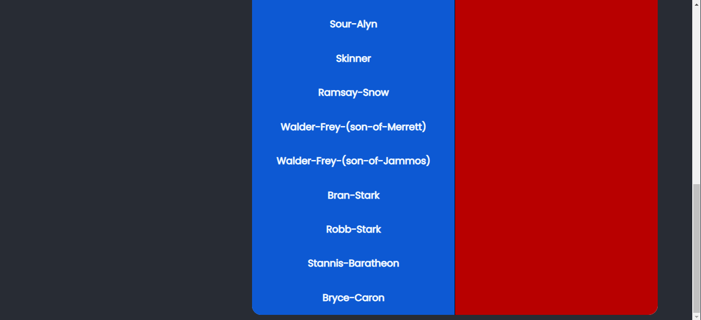

# Game of Thrones Network

**Número da Lista**: 1<br>
**Conteúdo da Disciplina**: Grafos1<br>

## Alunos
|Matrícula | Aluno |
| -- | -- |
| 18/0102656  |  Ítalo Vinícius |
| 18/0145088  |  Gabriel Bonifácio |

## Sobre 

<div align="center">

  
  
</div>

O projeto tem como objetivo observar a relação entre dois personagens quaisquer de Game of Thrones (GoT). Vamos utilizar os tipos de busca BFS e DFS para verificar a relação entre os dois e se essa relação existe.

### Apresentação

Para acessar a apresentação, basta acessar este link: <a href="https://youtu.be/iiXLOn63eVM" target="_blank">https://youtu.be/iiXLOn63eVM</a>

## Screenshots

<div align="center">

  

  [Figura 2: Imagem do programa](./images/got-network1.png)

</div>
  
<div align="center">

  
  
  [Figura 3: Imagem do programa](./images/got-network2.png)
  
 </div>
  
<div align="center">

  
  
  [Figura 4: Imagem do programa com utilização da barra lateral](./images/got-network3-scroll.png)
  
</div>

## Instalação 
**Linguagem**: Java Script<br>
**Framework**: React JS<br>

Para rodar o programa, é necessário a instalação do NodeJS, versão 16.13, com gerenciador de pacotes NPM.
Siga as instruções a seguir para rodar o programa:

1) Clonar o repositório.

```sh 
git clone https://github.com/projeto-de-algoritmos/Grafos1_GoT.git
```

2) Acessar a pasta da aplicação React

```sh 
cd Grafos1_GoT/got/
```

3) Instalar as dependências do Node

```sh 
npm install
```

4) Rodar a aplicação por meio do NPM

```sh 
npm start
```

5) Aguarde a aplicação rodar no seu navegador

6) Pronto. O aplicativo já estará rodando.

## Uso 

Basta colocar os 2 personagens na qual se queira ver a conexão que se dará por meio de grafos.

Duas divisões foram feitas: uma que representa a busca feita por profundidade (DFS) e uma outra por largura (BFS). Se apresentarão na tela algumas conexões (caso haja) que levará o personagem 1 até o personagem 2.


## Outros 

As informações de conexões foram extraídas dos livros, baseado nesse [repositório](https://github.com/mathbeveridge/asoiaf).
